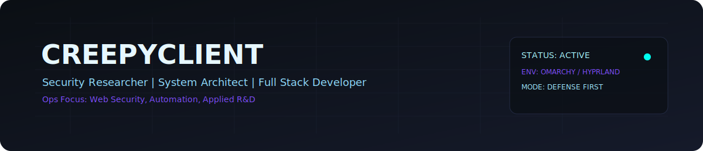
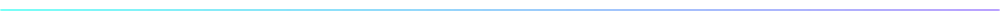
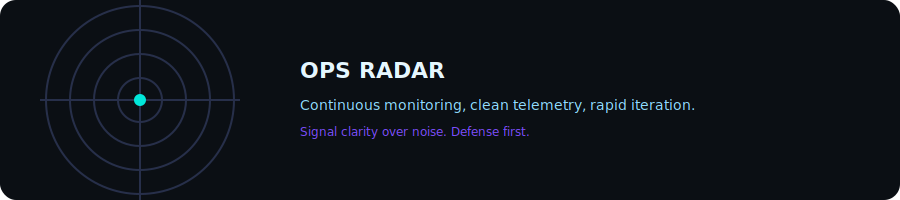

<!--
  Creepyclient GitHub Profile
  Theme: Omni Neon / Professional Ops
-->

  

  

<h2 align="center">Ops Summary</h2>

  <table>
    <tr>
      <td align="left" width="460">
        <b>Role:</b> Security Researcher, System Architect, Full Stack Developer 
        <b>Focus:</b> Web exploitation, browser security, automation 
        <b>Environment:</b> Omarchy (Arch) + Hyprland Wayland 
        <b>Delivery:</b> Clear reports, actionable fixes, modular playbooks
      </td>
      <td align="left" width="460">
        <b>Core Tracks:</b> 
        - Web App Security (XSS, SQLi, auth flows) 
        - Secure automation pipelines (n8n, scripts) 
        - Frontend engineering (React, Three.js) 
        - Linux hardening and ops tooling
      </td>
    </tr>
  </table>

 

  

 

  

<h2 align="center">Toolchain</h2>

  <table>
    <tr>
      <td align="center" width="120"> <b>Python</b></td>
      <td align="center" width="120"> <b>JavaScript</b></td>
      <td align="center" width="120"> <b>React</b></td>
      <td align="center" width="120"> <b>Docker</b></td>
    </tr>
    <tr>
      <td align="center" width="120"> <b>Linux</b></td>
      <td align="center" width="120"> <b>Git</b></td>
      <td align="center" width="120"> <b>C++</b></td>
      <td align="center" width="120"> <b>Java</b></td>
    </tr>
  </table>

 

  

 

  

 

<h2 align="center">Live Intel</h2>

   
  
  
  

 

  

 

  

